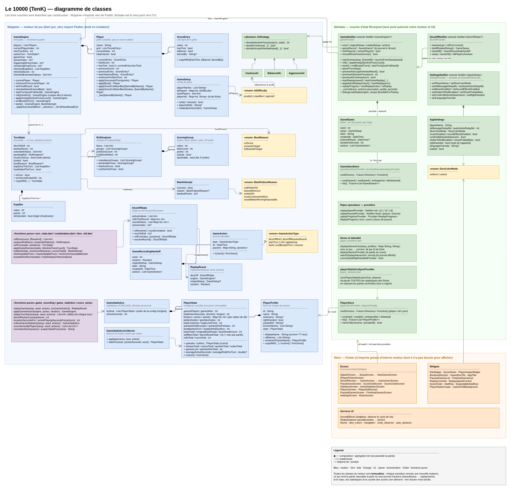

# Architecture de Le 10000 (TenK)

> Source éditable : [`architecture/class-diagram.drawio`](architecture/class-diagram.drawio).
> Le PNG embarque le diagramme : il se rouvre et se ré-édite directement dans
> draw.io, sans le `.drawio`.

## Trois couches, et pourquoi elles sont étanches

Le découpage n'est pas décoratif : il vient de la nature du jeu. Le règlement du
10000 est régional et truffé de cas limites (main pleine, règle d'extension,
tiret, barrage, victoire à 10000 pile) qu'on ne peut pas vérifier à l'œil dans
une interface. D'où la séparation :

- **`lib/game` — le moteur.** Dart pur, *zéro import Flutter*. C'est ce qui
  permet de le tester exhaustivement en isolation : la quasi-totalité des
  subtilités de règles se prouve par des tests unitaires sans widget.
- **`lib/state` — la couche d'état.** Notifiers Riverpod. Seul pont autorisé
  entre le moteur et l'interface, et seul endroit qui connaît à la fois les deux.
- **`lib/ui` — Flutter.** N'importe jamais d'interne moteur dont il n'a pas
  besoin pour afficher.

Sur le diagramme, aucune flèche ne relie directement l'UI au moteur : elles
passent toutes par les providers. C'est l'invariant à préserver.

## Le moteur (bleu)

**Tout y est immuable.** Chaque transition renvoie une nouvelle instance plutôt
que de muter l'existante. Ce n'est pas un réflexe de style : c'est ce qui rend
une partie rejouable à l'identique.

- **`GameEngine`** orchestre la partie : rotation des joueurs, héritage des dés
  entre tours, condition de victoire. Ses transitions (`startTurn`, `roll`,
  `applyKeep`, `bank`, `endBustedTurn`) sont les seules portes d'entrée.
- **`Player` porte une grille complète (`List<ScoreEntry>`), pas un score
  scalaire.** C'est délibéré : un tiret ou un barré s'attache à *la ligne* qui
  l'a reçue et y reste, même après des tours réussis. `Player.hasTiret` est
  exactement `currentEntry.hasTiret` — un seul fait, pas deux à synchroniser
  (les avoir dédoublés a déjà produit un bug d'affichage).
- **`TurnState`** modélise un tour sur plusieurs lancers : dés à lancer, score
  en cours, valeurs étendues, dés gardés, main pleine, craque et sa raison.
- **`RollAnalysis` / `ScoringGroup`** décrivent ce qu'un lancer vaut, en
  distinguant les groupes obligatoires des 5 isolés que le joueur peut décliner.

Les **fonctions pures** (encart violet) — `rollDice`, `analyzeRoll`, `rollTurn`,
`applyKeepDecision`, `tryBank` — sont des fonctions de haut niveau, pas des
méthodes. Le RNG y est injectable, ce qui rend les tests déterministes.

## L'IA (vert, dans le moteur)

`AiStrategy` est une interface à trois décisions ; trois profils l'implémentent
(`CautiousAi`, `BalancedAi`, `AggressiveAi`), sélectionnés par `AiDifficulty`.
La stratégie ne raisonne que sur le tour en cours : elle ignore le score déjà
acquis, donc le plafond de 10000. C'est `GameNotifier` qui borne ses réponses,
au seul endroit qui connaît les deux — et par le même calcul que celui affiché à
l'écran (`previewAiDeclineFives`), pour que l'affiché et le joué ne divergent
pas.

## La couche d'état (vert)

- **`GameNotifier`** enveloppe le `GameEngine` et expose les actions à l'UI. Ses
  méthodes `previewAi*` permettent d'afficher à l'avance ce que l'IA fera, sans
  rien modifier.
- **`SavedGame` ne stocke pas l'état, mais le journal d'actions** (`GameAction`)
  et la seed. Une partie se reconstruit en rejouant ce journal
  (`replayGame` → `ReplayResult`). C'est aussi ce qui permet le mode rejeu
  spectateur d'un run terminé.
- **`GameSaveStore`** lit/écrit les fichiers `.run` ; deux instances coexistent,
  une pour les parties en cours, une pour les archives.
- **`SettingsNotifier` / `AppSettings`** portent les préférences persistées.

## L'interface (orange)

Représentée volontairement en couche grossière : les widgets Flutter sont
structurellement uniformes, et les détailler noierait le modèle. À retenir :
`GameScreen` est de loin l'écran le plus dense (il rend des vues différentes
selon l'état du tour et pilote l'avancement automatique), et deux services
vivent à part — `SoundEffects` (singleton observant le cycle de vie) et
`ShakeDetector` (accéléromètre → lancer de dés).

## Régénérer le diagramme

Demandez simplement la mise à jour du diagramme d'architecture — par exemple
« mets à jour le diagramme de classes » — ou invoquez explicitement
`/architecture-diagram`.

La procédure est décrite dans
[`.claude/skills/architecture-diagram/SKILL.md`](../.claude/skills/architecture-diagram/SKILL.md) :
relever les classes dans le code, éditer le `.drawio`, exporter via
`.claude/skills/architecture-diagram/export.sh`, **relire le PNG produit**, puis
mettre ce document à jour.
